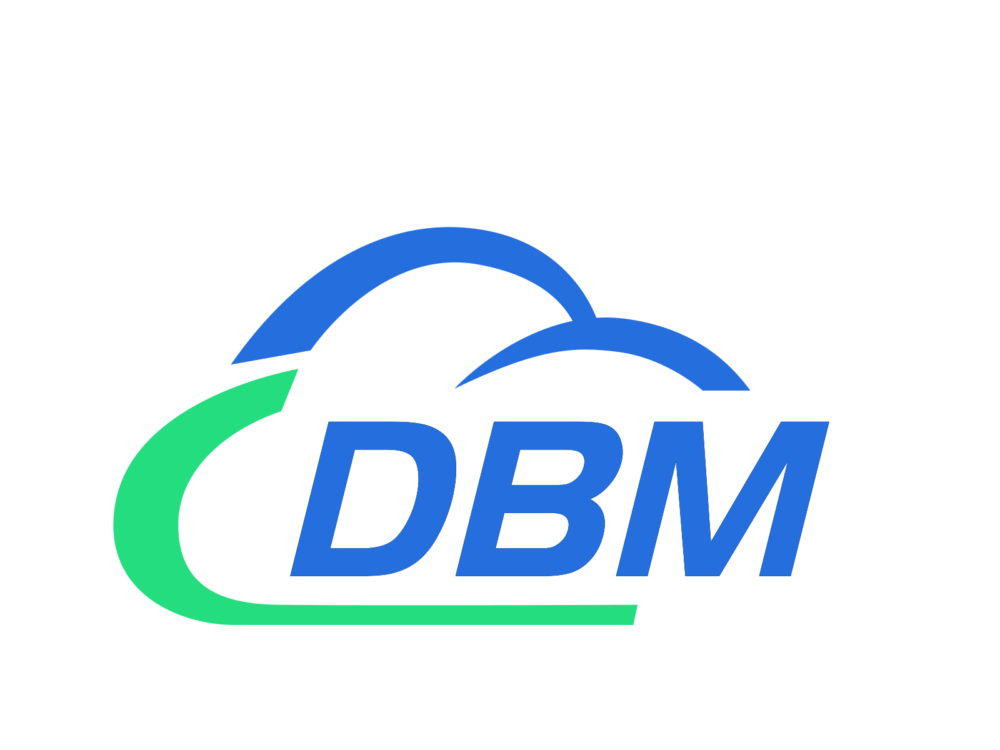

<br />
<p align="center">
    <a href="https://github.com/EdurtIO/incubator-dbm">
      
    </a>
    <h2 align="center">DBM</h3>
    <p align="center">
    An awesome database management tool specified for <a href='https://clickhouse.tech'>ClickHouse</a>. For more information: <a href='https://dbm.incubator.edurt.io'>https://dbm.incubator.edurt.io</a>.
    <br />
  </p>
</p>

---

Basic:

[](https://www.travis-ci.com/github/EdurtIO/incubator-dbm)
[](https://codebeat.co/projects/github-com-edurtio-incubator-dbm-master)
[](https://electronjs.org/) 
[](http://vuejs.org/)

GitHub:

[](https://github.com/EdurtIO/incubator-dbm/blob/master/LICENSE)
[](https://github.com/EdurtIO/incubator-dbm/issues)
[](https://github.com/EdurtIO/incubator-dbm/network)
[](https://github.com/EdurtIO/incubator-dbm/stargazers)

Gitee:

[](https://gitee.com/EdurtIO/incubator-dbm/stargazers)
[](https://gitee.com/EdurtIO/incubator-dbm/members)

## Thank you

- [Jetbrains](https://www.jetbrains.com/)

## :rocket: Features

- Support query history (pagination, clear all, etc.)
- Support selected sql clauses query
- Support terminating query
- Support table management (metadata, delete, preview)
- Support database management (delete, create)
- Support custom query
- Support multiple data sources management(connection test, monitoring)
- Support customized appearance
- Support monitor (processor, connection, query)
- Support migrate data

## :laughing: Download

- [Windows](https://github.com/EdurtIO/incubator-dbm/releases/download/1.4.0/dbm-win.zip)
- [Mac](https://github.com/EdurtIO/incubator-dbm/releases/download/1.4.0/dbm-mac.tar.gz)

## :gear: Installation

macOS and Windows

- Download zip from [here](https://github.com/EdurtIO/incubator-dbm/releases).
- Unzip the archive, and install to macOS Applications.

Other platforms

- Unsupported temporarily. You can install the DBM by [building from source](#hammer_and_wrench-build-from-source).

Install other versions?

- Go ahead to [Github Release](https://github.com/EdurtIO/incubator-dbm/releases) for all releases.

## :hammer_and_wrench: Build from source

1. Install dependencies

```bash
npm install -g node-sass

yarn install
```

2. Build electron app for production

```bash
yarn run build
```

3. Install from built zip: `./build/dbm-<OS>.*`

4. Run dev mode

```bash
yarn run dev
```

or

```bash
npm start
```
