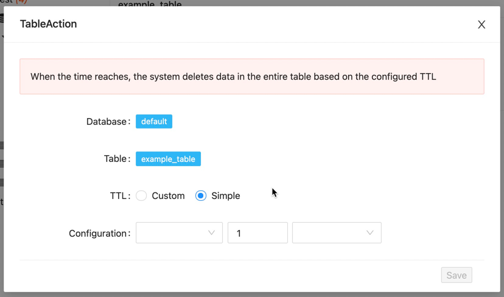
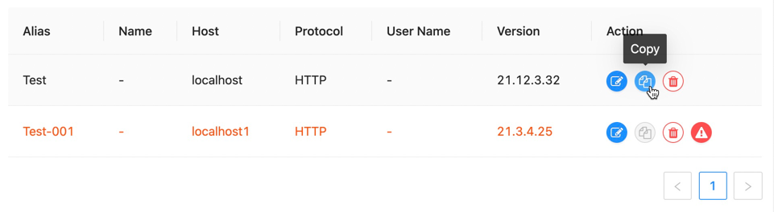
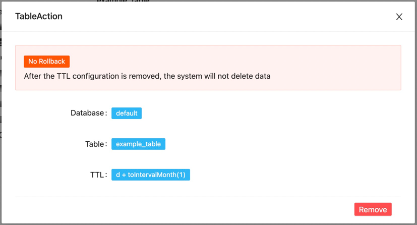
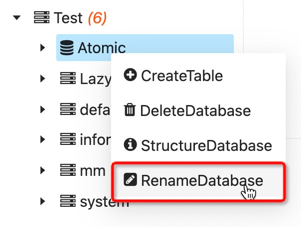

DBM Version for `1.14.0` is development!

!!! danger "Warning"

    The development version will not be released. If you need to experience, please pull the source code for local compilation. We will not release this version until the end of the final development work!!!

#### Enhancement

---

- Support visual build of MongoDB tables

- Supports adding the TTL of the table visually

- Support data source copy

- Supports remove the TTL of the table visually

- Supports metadata management to change database names

- Query history supports IndexDB storage

#### UI

---

- Unavailable data source disallows click action

#### Optimize

----

#### Docs

---

- Optimize data source management documentation
- Add Monitor --> Connection docs

#### Bug

---

#### Contributors (In no particular order)

---

- @qianmoQ
