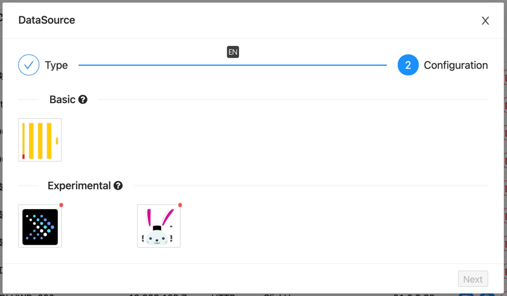
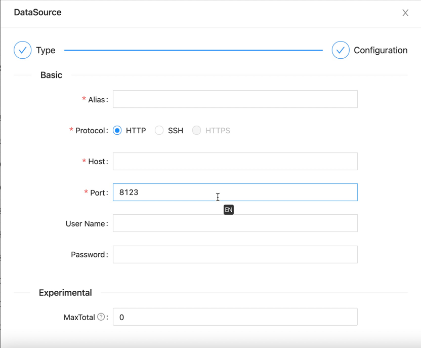

!!! note "ClickHouse"

    It is mainly used to describe how the software builds the ClickHouse data source for subsequent operations.

!!! warning "System requirements"

    \>= `1.0.0-SNAPSHOT`

### Supported Versions

---

| Version   | Tested?                                     |
|-----------|---------------------------------------------|
| `19.10.x` | :material-checkbox-marked-circle:{.success} |
| `20.11.x` | :material-checkbox-marked-circle:{.success} |
| `21.3.x`  | :material-checkbox-marked-circle:{.success} |
| `22.12.x` | :material-checkbox-marked-circle:{.success} |

!!! note "Supported versions"

    Most versions have been tested, please submit issues for non-adapted versions.

### Created a Source

---

After entering the data source management page, click the Add data source button.

Select the ClickHouse icon in the `Basic` type (the first one).

After selecting the type, click the `Next` button at the bottom to configure the relevant information.

!!! note "Supported protocols"

    - [x] `HTTP`
    - [x] `SSH`

#### HTTP Protocol

---

!!! note "HTTP Protocol"

    Use the HTTP interface provided by ClickHouse to connect to the service.

| Parameter   | Description                                                                                         | Required | Unique | Default |
|-------------|-----------------------------------------------------------------------------------------------------|----------|--------|---------|
| `Alias`     | The alias of the data source, which will be displayed later in the selected data source on the page | Yes      | Yes    |         |
| `Host`      | The host of the ClickHouse server                                                                   | Yes      | Yes    |         |
| `Port`      | The port of the ClickHouse server                                                                   | Yes      | Yes    | `8123`  |
| `User Name` | The user name of the ClickHouse server                                                              | Yes      | No     |         |
| `Password`  | The password of the ClickHouse server                                                               | Yes      | No     |         |

When we have configured the above parameters, click the `Test` button at the bottom. If the service can be accessed normally, the `OK` button can be used. Click it and it will be saved.

#### SSH Protocol

---

!!! note "SSH Protocol"

    The SSH protocol will remotely access the target ClickHouse service through the springboard machine (configured SSH server).

The SSH protocol first needs to fill in the relevant configuration information in the HTTP protocol.

!!! warning "SSH Configuration"

    The difference is that the SSH protocol has the following configurations.

| Parameter   | Description                     | Required | Unique | Default  |
|-------------|---------------------------------|----------|--------|----------|
| `SSH Host`  | The host of the SSH server      | Yes      | Yes    |          |
| `SSH Port`  | The port of the SSH server      | Yes      | Yes    | `22`     |
| `User Name` | The user name of the SSH server | Yes      | Yes    | `root`   |
| `Password`  | The password of the SSH server  | Yes      | Yes    | `123456` |

When we have configured the above parameters, click the `Test` button at the bottom. If the service can be accessed normally, the `OK` button can be used. Click it and it will be saved.
