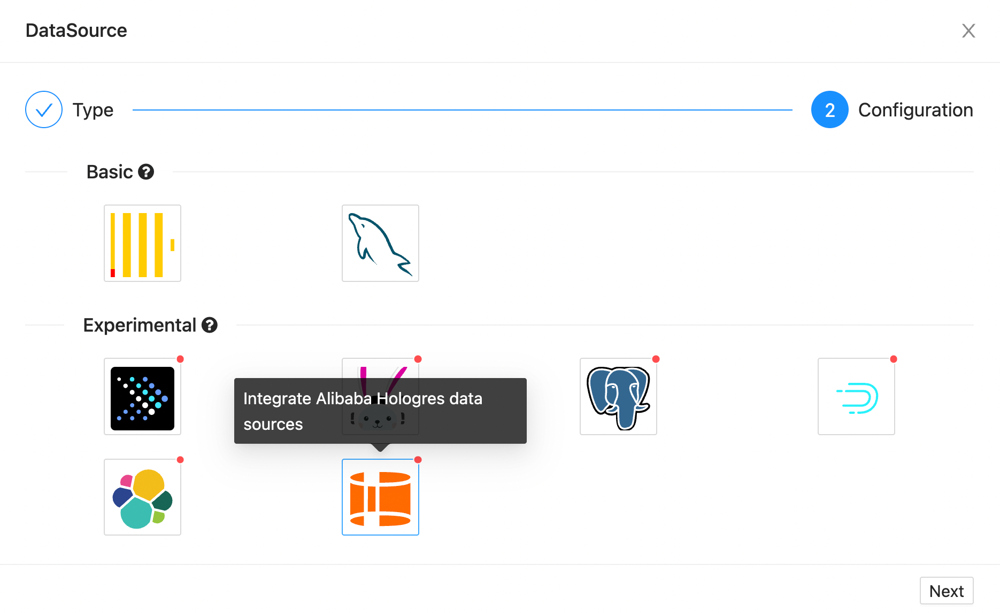
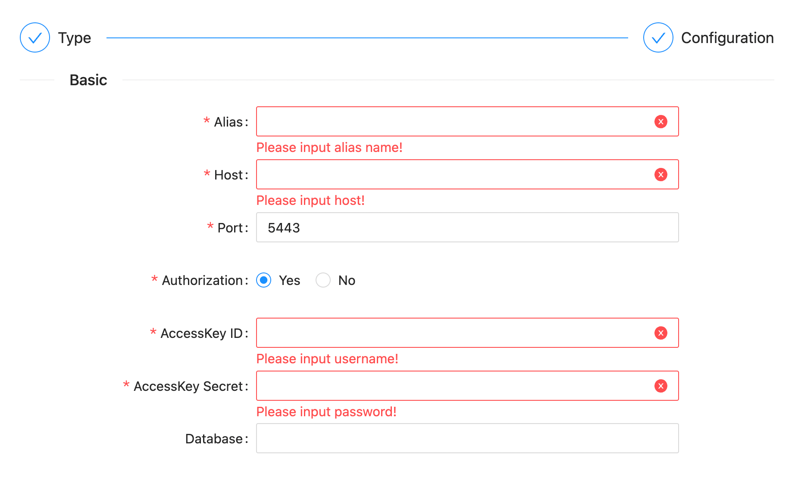

!!! note "Hologres"

    It is mainly used to describe how the software builds the Hologres data source for subsequent operations.

!!! warning "System requirements"

    \>= `1.22.0`

### Supported Versions

---

| Version | Tested?                                     |
|---------|---------------------------------------------|
| `1.0.x` | :material-checkbox-marked-circle:{.success} |

!!! note "Supported versions"

    Most versions have been tested, please submit issues for non-adapted versions.

### Created a Source

---

After entering the data source management page, click the Add data source button.

Select the Hologres icon in the `Experimental` type (the fourth).

After selecting the type, click the `Next` button at the bottom to configure the relevant information.

!!! note "Supported protocols"

    - [x] `TCP`

#### TCP Protocol

---

!!! note "TCP Protocol"

    Use the TCP interface provided by Hologres to connect to the service.

| Parameter          | Description                                                                                         | Required | Unique | Default |
|--------------------|-----------------------------------------------------------------------------------------------------|----------|--------|---------|
| `Alias`            | The alias of the data source, which will be displayed later in the selected data source on the page | Yes      | Yes    |         |
| `Host`             | The host of the Hologres server                                                                     | Yes      | Yes    |         |
| `Port`             | The port of the Hologres server                                                                     | Yes      | Yes    | `5443`  |
| `AccessKey ID`     | The user name of the Hologres server                                                                | No       | Yes    |         |
| `AccessKey Secret` | The password of the Hologres server                                                                 | No       | Yes    |         |
| `Database`         | The database of the Hologres server                                                                 | No       | Yes    |         |

When we have configured the above parameters, click the `Test` button at the bottom. If the service can be accessed normally, the `OK` button can be used. Click it and it will be saved.
