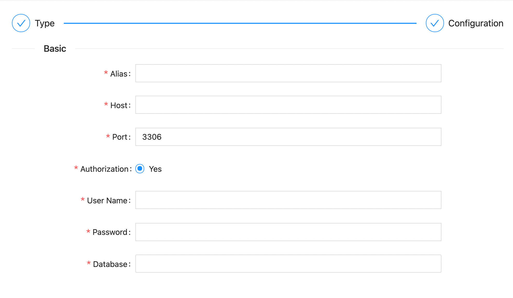

!!! note "MySQL"

    It is mainly used to describe how the software builds the MySQL data source for subsequent operations.

!!! warning "System requirements"

    \>= `1.18.0`

### Supported Versions

---

| Version | Tested?                                     |
|---------|---------------------------------------------|
| `5.6.x` | :material-checkbox-marked-circle:{.success} |
| `5.7.x` | :material-checkbox-marked-circle:{.success} |

!!! note "Supported versions"

    Most versions have been tested, please submit issues for non-adapted versions.

### Created a Source

---

After entering the data source management page, click the Add data source button.

Select the MySQL icon in the `Experimental` type (the third).

After selecting the type, click the `Next` button at the bottom to configure the relevant information.

!!! note "Supported protocols"

    - [x] `HTTP`

#### HTTP Protocol

---

!!! note "HTTP Protocol"

    Use the HTTP interface provided by MySQL to connect to the service.

| Parameter   | Description                                                                                         | Required | Unique | Default |
|-------------|-----------------------------------------------------------------------------------------------------|----------|--------|---------|
| `Alias`     | The alias of the data source, which will be displayed later in the selected data source on the page | Yes      | Yes    |         |
| `Host`      | The host of the MySQL server                                                                        | Yes      | Yes    |         |
| `Port`      | The port of the MySQL server                                                                        | Yes      | Yes    | `3306`  |
| `User Name` | The user name of the MySQL server                                                                   | Yes      | Yes    |         |
| `Password`  | The password of the MySQL server                                                                    | Yes      | Yes    |         |
| `Database`  | The database of the MySQL server                                                                    | Yes      | Yes    |         |

When we have configured the above parameters, click the `Test` button at the bottom. If the service can be accessed normally, the `OK` button can be used. Click it and it will be saved.
