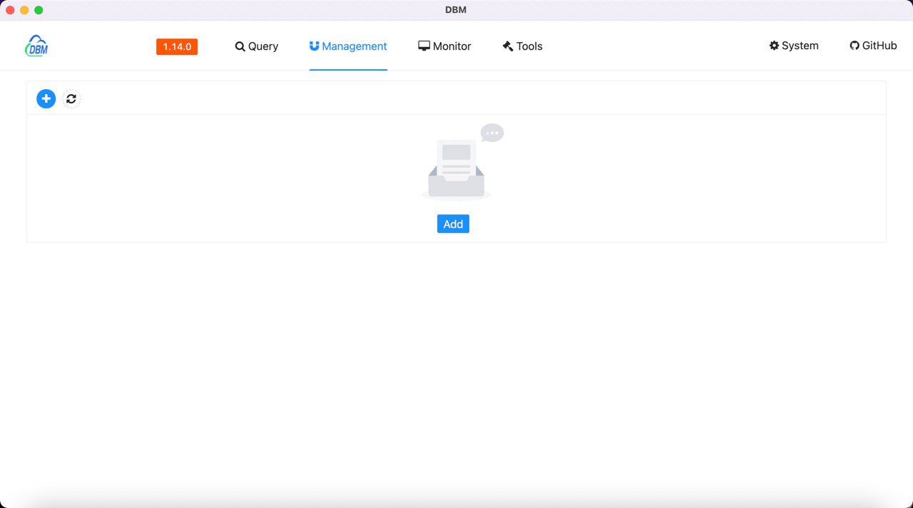
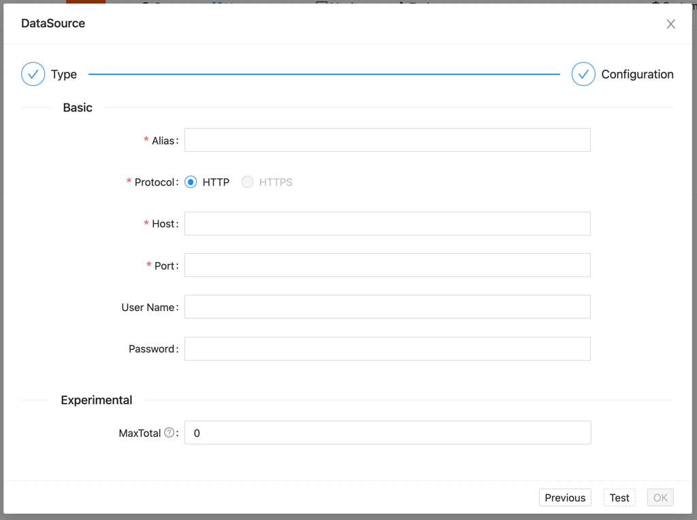
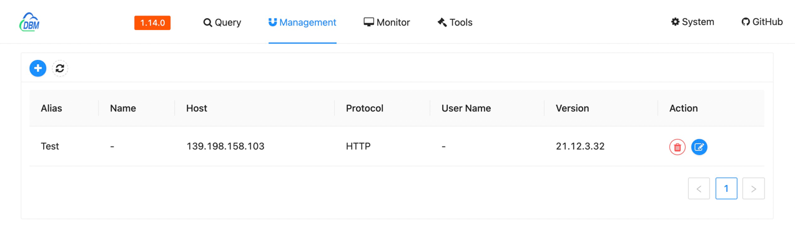

The data source is mainly used to manage the Clickhouse service data source for later query monitoring.

### Create a data source

---

Move the mouse to the top menu `Management` and wait for the drop-down options to appear, click `DataSource` to enter the data source management interface, which is similar to the following page

!!! note

    When opening the software for the first time, an `Add` blue button will be displayed in the middle of the page!

Click the `Add` button (blue) to add a data source. The following popup appears:

##### DataSource Type

---

In the first step, we need to select the type of data source. We click the `ClickHouse` icon to select the data source, and click `Next` to configure the parameters.

##### DataSource Configuration

---

It has two types of datasource parameters：

###### Basic Settings

- `Alias`: This field is only used to mark the alias of the current property. The default `localhost` is easy to remember and has no special meaning.
- `Protocol`: Connection service protocol, default `http`
- `Host`: Enter the hostname or IP address of the remote server here, the default is `localhost`
- `Port`: Enter the host address of the remote server here, corresponding to the open port, the default is `8123`
- `User Name`: Connection service user name, input when setting, default `default`
- `Password`: Connection service user password, if set, please enter

###### Experimental Settings

!!! note "Warning"

    This configuration may be unstable, but it will not cause software errors, only some functions will not take effect, and will continue to be converted to official functions in the future

- `MaxTotal`: Maximum number of data query rows

---

When we fill in the basic configuration, click the `Test` button at the bottom, and the `OK` button can be clicked after the test is passed.

After clicking the `OK` button, we will save the configuration information you wrote for the next time

Configuration information can be saved in two states

- `Stop`: A stopped state, meaning the service is currently unavailable, marked with a stop icon
- `Start`: Available status, indicating that the service is currently available for operations such as query, and is marked with a play icon

!!! note

    We do not allow saving of untested services, please make sure it is available to save again.

After the configuration is saved successfully, the pop-up box will be closed and the list of data just saved will be displayed on the page

#### DataSource Operations

---

There are two buttons at the top of the list

:material-plus-circle:{.blue} for adding new data sources

:material-refresh: for refreshing all data sources

!!! warning

    This operation will traverse all data sources to request to verify the availability of data sources

##### List of data sources

|Field| Description                                   |
|---|-----------------------------------------------|
|Alias| DataSource Alias                              |
|Name| The name of the data source build             |
| Host | The hostname of the data source configuration |
|Protocol| access protocol used                          |
|User Name| Username to access the service                |
|Version| The version of the current server             |
|Action| Additional Operations for Data Sources        |

If the test fails, the following list will be displayed

##### Delete DataSource

There is a :material-delete-circle:{.red} icon under the `Action` column of the list data of the data source, when we click it, the following content will appear

The data source will be deleted after clicking the `OK` button

Click `Cancel` to close the prompt box without doing anything

##### Modify DataSource

The modification and addition operations are basically the same, the difference is that the modification will fill the data into the corresponding input box when the pop-up box is called up.
