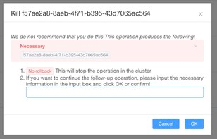
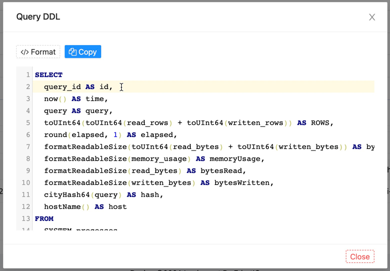

This document mainly introduces how we use the Processor monitoring function provided by the software.

##### Redirect

---

After the mouse moves to the `Monitor` menu, a drop-down box will automatically pop up. Select the `Processor` sub-menu in the drop-down box and click it, and it will jump to the corresponding management page. His snapshot is similar to the following screenshot:


> By default, the selection item after `Server` on the top left is blank, you need to manually select a data source

##### Execute

---

On the right side of the top menu, there will be a `Threshold` (unit/ms) value input window, which is used for our update time interval. When we turn on the `Auto` function on the right, the software will input the value according to `Threshold` Automatically refresh the data.


The chart in the middle part is used to mark the total number of processes of the current query of the currently selected server. The chart has a maximum of 20 points by default, and each time point will automatically cover the previous expired data points.


The bottom data table is used to render the detailed process of the server's specific query at our current time. It provides the following indicators:

- `Time`: The time the current process is running
- `Rows`: The number of rows to be queried in the current process query (`read_rows`+`written_rows`)
- `Elapsed`: Process query time (unit/ms)
- `Bytes`: The bytes consumed by the current process query (`read_bytes`+`written_bytes`)
- `memoryUsage`: Memory consumed by the query
- `bytesRead`: Query the number of bytes read
- `bytesWritten`: Query the number of bytes written
- `hash`: The hash of this query
- `host`: The host name of the service being queried

> The above data are from the `system.processes` table

##### Action

---

We also provide two operations in the detailed list:

- `KILL`: Stop the current query (**Note: This operation cannot be rolled back**)
- `DDL`: Query the specific SQL statement of the current query

###### Kill

When our query takes a long time, we can click the :fontawesome-solid-stop:{.red} button, and it will A window like the following pops up:



The window gives us two important tips, which need to be read carefully. If you are sure to perform the operation, enter the unique data marked under the `Necessary` prompt in the input box, and then click the `OK` button.

It will send a KILL command to the server, the specific command executed is as follows

```sql
KILL QUERY WHERE query_id = 'f57ae2a8-8aeb-4f71-b395-43d7065ac564'
```

###### DDL

When we need to view the specific SQL of this query, we can click the :octicons-search-16:{.blue} button, and it will A window like the following pops up:



The editor is the specific SQL statement we query this time.
