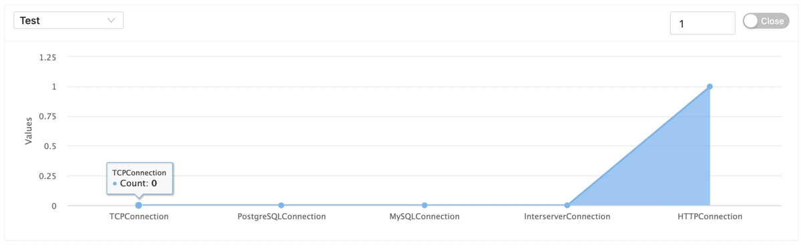

本文档主要介绍我们如何使用软件提供的连接监控功能。

鼠标移向顶部菜单 `Monitor` 等待下拉选择项出来后, 点击 `Connection` 即可进入连接监控界面, 它类似于以下页面

在页面中上半部分为数据图表展示&功能配置区, 下半部分为详细数据列表区

#### 数据图表 & 功能配置

---

在顶部左侧下拉选择框用于选择配置好的数据源, 选择后软件会向服务发起请求获取信息, 返回类似以下数据图表

图表中会展示各种活跃连接的数量

在顶部的右侧有一个 `数字输入器` 和 `选择器`

`数字输入器` 用于标记刷新数据的分割时间(单位秒)

`选择器` 用于标记是否自动刷新数据,当开启该选项时,软件会根据 `数字输入器` 数据进行数据刷新

#### 数据详情

---

在顶部左侧下拉选择框用于选择配置好的数据源, 选择后软件会向服务发起请求获取信息, 返回类似以下结果

| 属性         | 描述           |
|------------|--------------|
| categories | 连接类型(使用名称标记) |
| value      | 当前类型的使用数量    |
