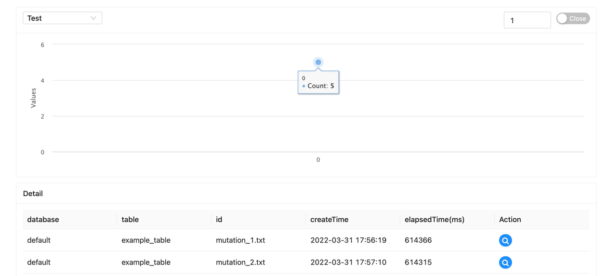
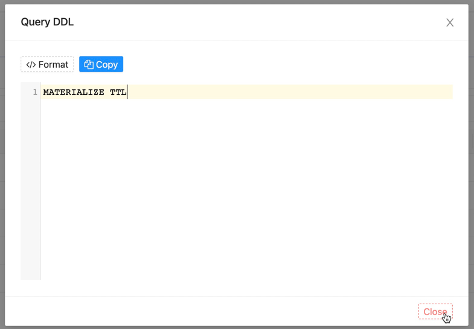

This document mainly introduces how we can use the `Mutations` monitoring function provided by the software.

Move the mouse to the top menu `Monitor` and wait for the drop-down options to appear, click `Mutations` to enter the connection monitoring interface, which is similar to the following page

The upper part of the page is the data chart display & function configuration area, and the lower part is the detailed data list area

#### Data charting & Feature Configuration

---

The drop-down selection box on the top left is used to select the configured data source. After selection, the software will initiate a request to the service to obtain information, and return a data chart similar to the following

The graph shows the number of various active connections

On the top right side there is a `Numeric` and `Selector`

`Numeric input` is used to mark the split time of refresh data (unit: second)

The `selector` is used to mark whether to automatically refresh the data. When this option is turned on, the software will refresh the data according to the `digital input` data

#### Details of the data

---

The drop-down selection box on the top left is used to select the configured data source. After selection, the software will initiate a request to the service to obtain information, and return results similar to the following

| Property        | Description                 |
|-----------------|-----------------------------|
| database        | Database of operations      |
| table           | Table of data for operation |
| id              | The operations signature    |
| createTime      | Action creation time        |
| elapsedTime(ms) | Operation time (ms)         |

#### Action

---

:octicons-search-16:{.blue} button To query the DDL statement of the operation

