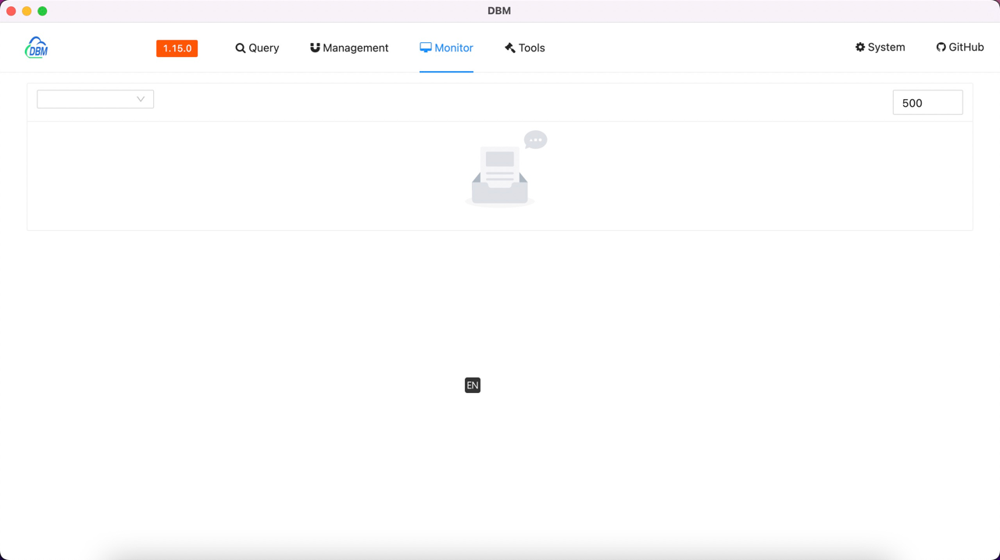
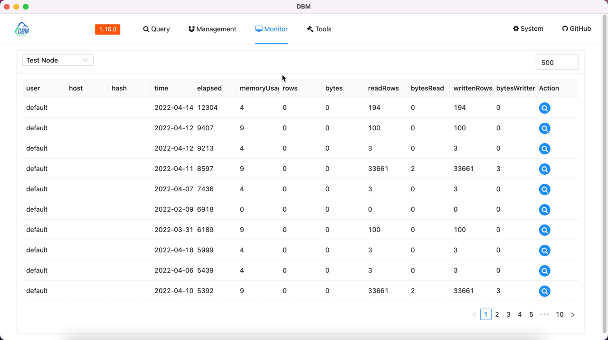

This document mainly introduces how we can use the `Slow query` monitoring function provided by the software.

Move the mouse to the top menu `Monitor` and wait for the drop-down options to appear, click `Query` to enter the query monitoring interface, which is similar to the following page

The upper part of the page is the data chart display & function configuration area, and the lower part is the detailed data list area

#### Data charting & Feature Configuration

---

The drop-down selection box on the top left is used to select the configured data source. After selection, the software will initiate a request to the service to obtain information, and return a data chart similar to the following

There is a `Number` input device at the top right

`Numeric input` is used to mark the maximum time-consuming limit of the query (unit: milliseconds)

#### Details of the data

---

The drop-down selection box on the top left is used to select the configured data source. After selection, the software will initiate a request to the service to obtain information, and return results similar to the following

| Property     | Description                                                |
|--------------|------------------------------------------------------------|
| user         | Query the user used                                        |
| host         | Query the client host                                      |
| hash         | Query the generated hash data                              |
| time         | Query creation time                                        |
| elapsed(ms)  | Query time (ms)                                            |
| memoryUsage  | Memory used by query                                       |
| rows         | Query the total number of rows                             |
| bytes        | Total number of bytes queried                              |
| readRows     | Query the total number of rows of read metadata            |
| bytesRead    | Query the total number of bytes of metadata read           |
| writtenRows  | The total number of bytes of metadata written to the query |
| bytesWritten | The total number of bytes of metadata written to the query |

#### Action

---

:octicons-search-16:{.blue} button To query the DDL statement of the operation

