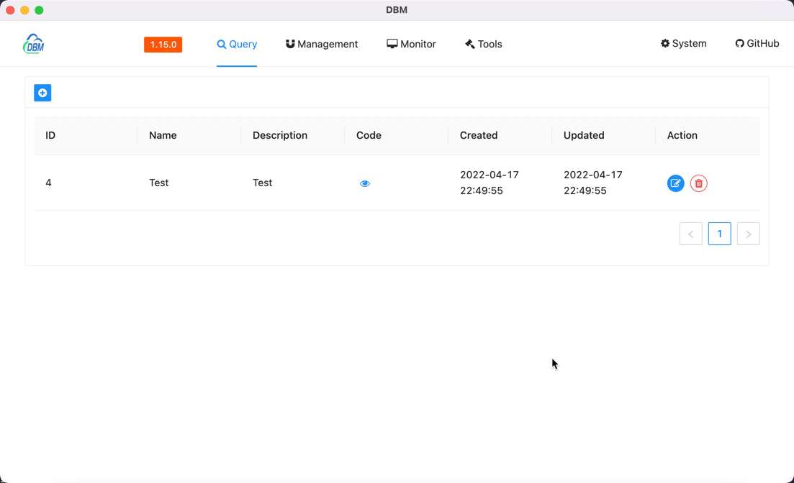
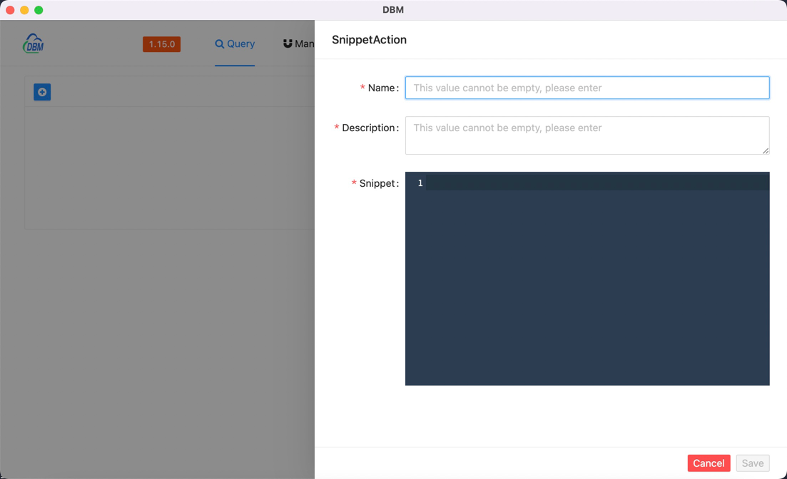
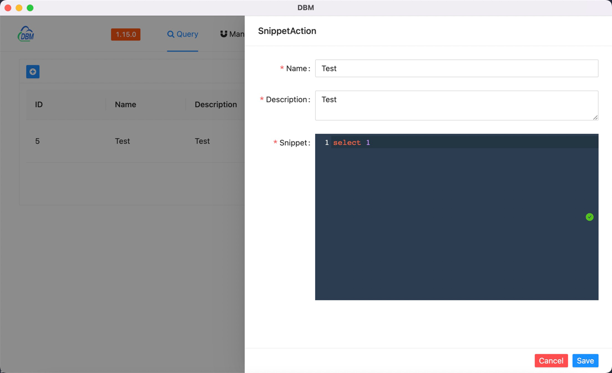

The code fragment function is mainly used to customize the reserved code for subsequent quick use of the code.

!!! warning 

    This feature is launched in the `1.15.0` version.

### Snippet

---

Move the mouse to the top menu `Query` and wait for the drop-down options to appear, click `Snippet` to enter the code snippet interface, which is similar to the following page

#### Field Description

---

| Field       | Meaning                                                       |
|-------------|---------------------------------------------------------------|
| ID          | Unique mark of data record                                    |
| Name        | The name of the code fragment, used to mark the code fragment |
| Description | Description information of the code fragment                  |
| Code        | Actual input code fragment                                    |
| Created     | Creation time                                                 |
| Updated     | Updated time                                                  |

By default, the content of this page is as follows

### Create a new snippet

---

Click the blue button in the middle of the page or the blue plus button in the upper left corner to add a new code fragment.

#### Field Description

---

| Field       | Meaning                                                       |
|-------------|---------------------------------------------------------------|
| Name        | The name of the code fragment, used to mark the code fragment |
| Description | Description information of the code fragment                  |
| Snippet     | Actual input code fragment                                    |

When all the content is entered and the verification is passed, click the blue button at the bottom right to save.

Click the red button to cancel the current operation process.

### Edit data record

---

Click the blue button under the operation column to edit the data record, and it will be automatically filled into the editor, similar to the following page.

### Delete data record

---

The software provides the function of deleting code fragments. Click the red button under the operation column after the data is recorded, and the following window will pop up.

Click the blue button to delete the data.

Click the white button to cancel the data deletion operation.
