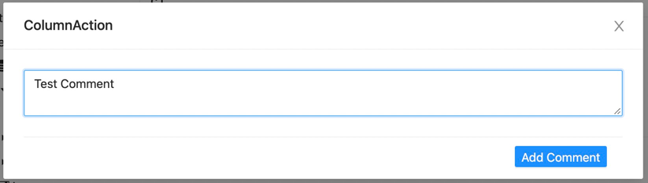
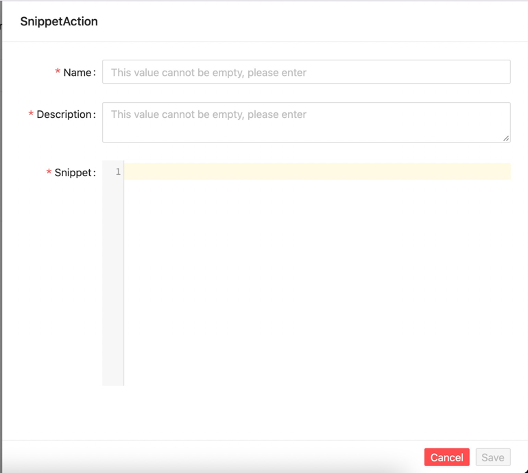
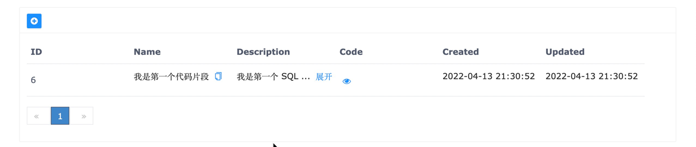
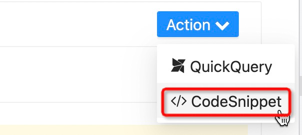
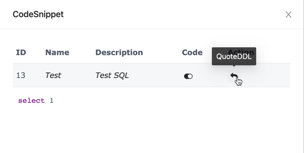
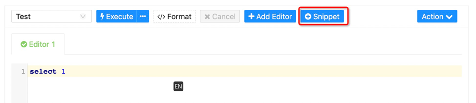
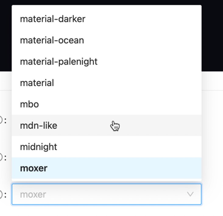
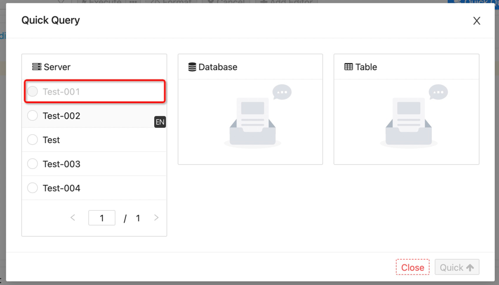
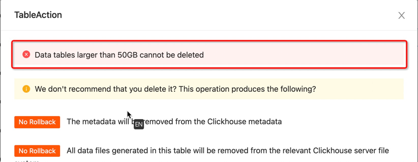

DBM Version for `1.15.0` is released!

Release Time: `2020-04-25`

#### Enhancement

---

- Support metadata management, add column description information  

- Support code snippet management  
  
 
 
- Support query reference code snippet  
 
 
- Support to quickly add code snippets after successful query  
 
- The data source supports IndexDB storage

#### UI

---

- Add multiple editor themes  
  
- Quick query unavailable nodes prohibit operations  
  
- It is forbidden to use functions such as quick query if the data source is not selected

#### Optimize

----

- Add data sheet deletion prompt greater than 50GB  

#### Docs

---

- Add snippet docs
- Add monitor --> query docs

#### Bug

---

- Fix the problem that invalid metadata management nodes can be clicked
- Fix the exception that the optional parameters of the metadata management creation of the MongoDB data table cannot be constructed
- Fix the error reported by the metadata management data table console

#### Contributors (In no particular order)

---

- @qianmoQ
