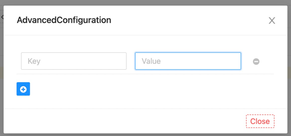
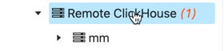
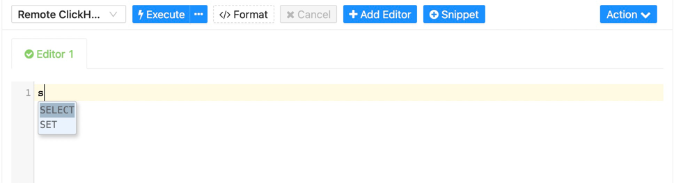
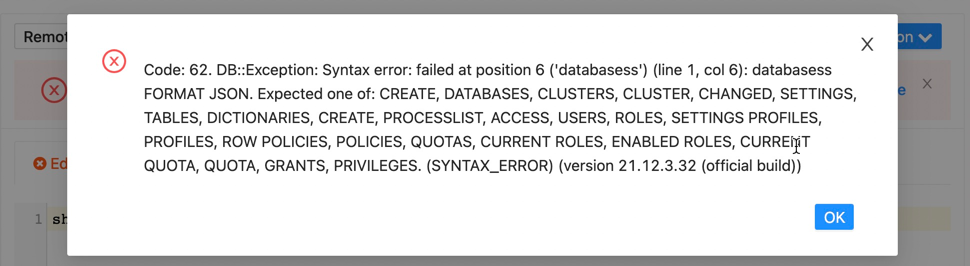

DBM Version for `1.16.0` is released!

Release Time: `2022-05-13`

#### Enhancement

---

- SSH login is supported [issues-40](https://github.com/EdurtIO/dbm/issues/40)  
    
- Support query ClickHouse to dynamically add configuration  
    
    
- Support metadata management to filter the database  
    
    
    
- Support automatic prompt function of code editor  
    

#### UI

---

- Optimize query history display list  
    
- Migrate the software update function to the system menu  
- Support editor bracket matching  
    

#### Optimize

----

- Optimize error reporting pop-up window [issues-148](https://github.com/EdurtIO/dbm/issues/148)  
    
    

#### Docs

---

- Fix Monitor --> Processor document image pointing error

#### Bug

---

- Fix the release error that the new version of the CI tool was not merged with the code release error

#### Contributors (In no particular order)

---

- @qianmoQ
