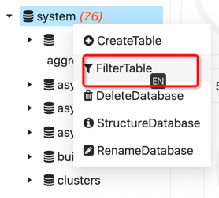
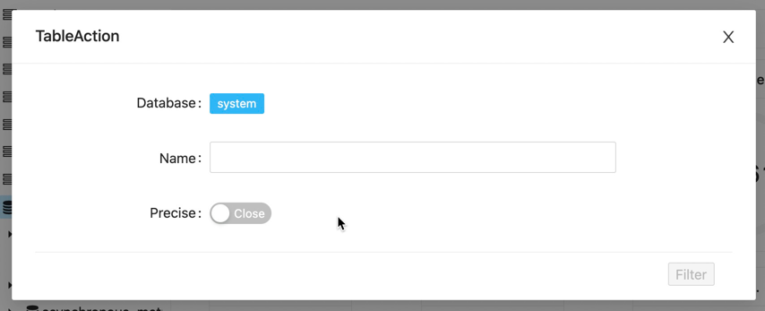
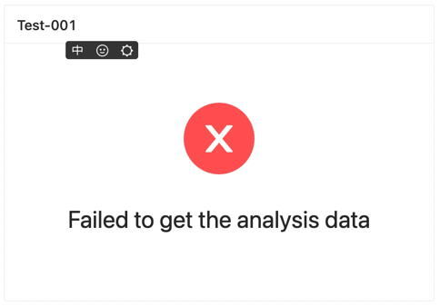

DBM Version for `1.17.0` is released!

Release Time: `2022-05-29`

#### Enhancement

---

- Support metadata management to filter the table  
  
  
  
- Support trino and presto for query  
  
- Support trino and presto for monitor --> processors  
- Support trino and presto for monitor --> connection  
- Support trino and presto for monitor --> slow query  

#### UI

---

- Add multiple editor themes  
- Query the list of data sources on the page, support the display of logo  
  

#### Optimize

----

- Optimize project description and introduction  
- Optimize the homepage is not available & does not support data source charts  
  
  

#### Docs

---

- Refactoring software homepage  
- Add clickhouse datasource docs  
- Add presto & trino datasource docs  

#### Bug

---

- Fix the exception that the data source is not selected in the track, the Track list can be selected  

#### Contributors (In no particular order)

---

- @qianmoQ
